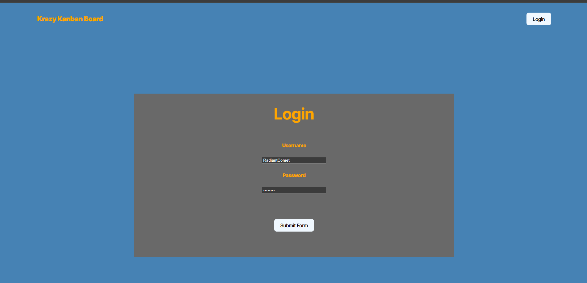
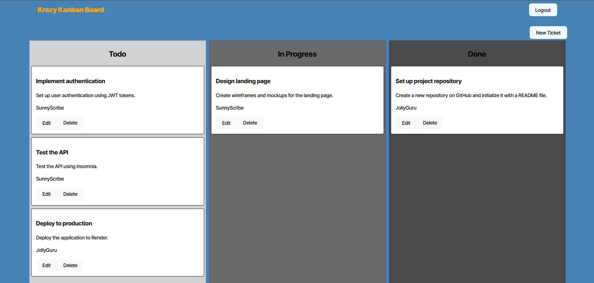
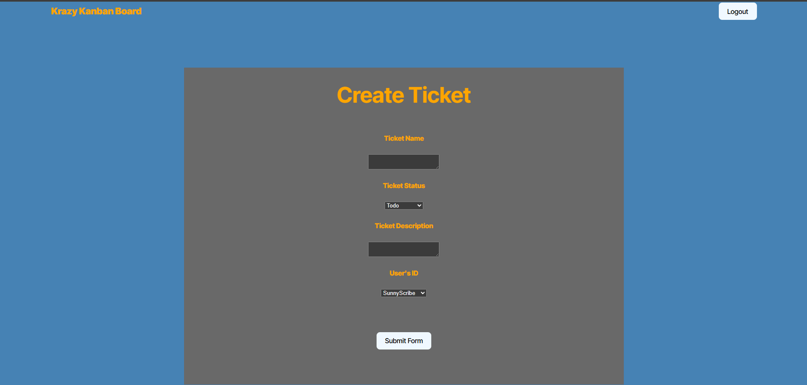

# Kanban Board


## Table of Contents
* [Description](#description)
* [Installation](#installation)
* [Technologies](#technologies)
* [License](#license)
* [Links](#links)
* [Questions](#questions)


## Description
Starter code for a Kanban was provided. The purpose of this application is to learn how to apply JWT authentication. You can login using the various seeded users located at server/src/seeds/user-seeds.ts. The Kanban has been styled (to a degree) by me, and is fully functional. 
<br><br>





## Installation
You can click the link below for the application deployed to Render, 
   or run locally by running the following at root:

```bash
psql -U postgres
\i server/db/schema.sql
\q
```

```bash
npm i
npm run build
npm run seed
npm start
```

## Technologies

* JavaScript
* TypeScript
* PostgreSQL
* Node.js
* React
* JWT Authentication

## License
This project is licensed under the MIT License

## Links
[GitHub Repo](https://github.com/Bakenavva/Kanban-Board)
[Deployed Application](https://kanban-board-mlms.onrender.com)

## Questions
Further questions can reach me via:
- GitHub: [Bakenavva](https://github.com/Bakenavva)
- Email:  ernestoaleman00@gmail.com
